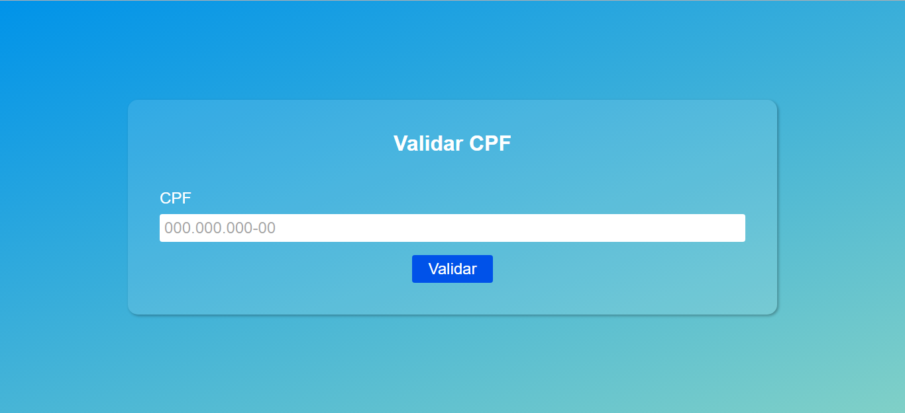
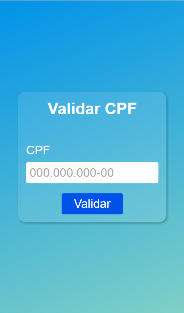

# Projeto | Validar CPF

### Desenvolvido como projeto de estudo.

### Focos de estudo: regex e o uso de classes.

Confira o resultado clicando [aqui](https://jeanwisotscki.github.io/validar-cpf/) (Dica: control + click para abrir o link em uma nova guia. 😉)

# Design

# Techs usadas no desenvolvimento

- HTML
- CSS
- JS
- GIT

# Desenvolvido por

- [@jeanwisotscki](https://github.com/jeanwisotscki/)
